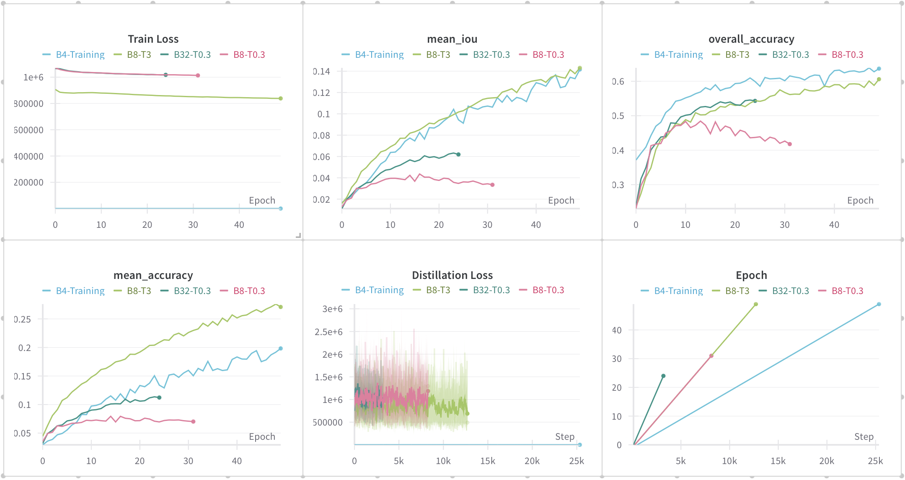

# Quantization-Aware Distillation

DistiQAT is a framework for efficient semantic segmentation using a combination of knowledge distillation and quantization-aware training (QAT). The project focuses on optimizing SegFormer models for better efficiency while maintaining performance.



## Overview

This project implements techniques to make semantic segmentation models more efficient and deployable in resource-constrained environments:

1. **Knowledge Distillation**: Transfer knowledge from a larger, more powerful "teacher" model (e.g., SegFormer-B4) to a smaller, more efficient "student" model (e.g., SegFormer-B0)
2. **Quantization-Aware Training (QAT)**: Convert floating-point models to quantized formats for faster inference and reduced memory footprint
3. **Evaluation Framework**: Comprehensive tools for assessing model performance and visualizing segmentation results

## Project Structure

- `SegFormer.py`: Implementation of the SegFormer architecture for semantic segmentation
- `distillation.py`: Framework for knowledge distillation between teacher and student models
- `qat.py`: Implementation of Quantization-Aware Training
- `train.py`: Standard training script for SegFormer models
- `dataset.py`: Dataset handling for semantic segmentation data (ADE20K dataset)
- `evaluation.py`: Evaluation metrics and visualization tools
- `test_model.py`: Model testing utilities
- `ade20k_utils.py`: Utilities for working with the ADE20K dataset
- `id2label.json`: Mapping from class IDs to human-readable labels

## Key Features

### Knowledge Distillation

The distillation process transfers knowledge from a larger model to a smaller one using:
- Temperature-scaled softening of probability distributions
- Weighted combination of distillation loss and standard cross-entropy loss
- Fine-tuning on the target dataset

```python
# Example configuration for distillation
config = DistillationConfig(
    trainer_model='nvidia/segformer-b4-finetuned-ade-512-512',
    student_model='nvidia/segformer-b0-finetuned-ade-512-512',
    batch_size=8,
    num_epochs=50,
    log_wandb=True
)
```

### Quantization-Aware Training

QAT prepares models for deployment on hardware with quantized operations:
- Fuses operations where possible (Conv+BN+ReLU)
- Simulates quantization during training
- Converts to fully quantized models at the end of training

```python
# Apply QAT to a model
model_qat = QATModel(model_fp32)

# After training, convert to fully quantized model
QATModel.convert_fully_quantized(model_qat)
```

### Evaluation Framework

Comprehensive evaluation and visualization tools:
- Mean IoU metrics for segmentation quality
- Per-category accuracy and IoU
- Visualization of segmentation outputs
- Class frequency analysis

## Requirements

- PyTorch
- Transformers
- Torchvision
- Evaluate
- Weights & Biases (for logging)
- PIL
- Matplotlib
- NumPy
- tqdm

## Usage

### Standard Training

```python
from train import Trainer, TrainConfig

config = TrainConfig(
    model='nvidia/segformer-b0-finetuned-ade-512-512',
    batch_size=4, 
    num_epochs=50, 
    log_wandb=True
)
trainer = Trainer(config)
trainer.train()
```

### Distillation Training

```python
from distillation import DistilModel, DistillationConfig

config = DistillationConfig(
    trainer_model='nvidia/segformer-b4-finetuned-ade-512-512',
    student_model='nvidia/segformer-b0-finetuned-ade-512-512',
    batch_size=8, 
    num_epochs=50, 
    log_wandb=True
)
distillation = DistilModel(config)
distillation.train()
```

### Evaluation

```python
from evaluation import Metrics
from SegFormer import SegformerForSemanticSegmentation

model = SegformerForSemanticSegmentation.from_pretrained('nvidia/segformer-b0-finetuned-ade-512-512')
model.load_state_dict(torch.load('saved_weights/b4_to_b0_distill.pth'))
results = Metrics.evaluate_model(
    model, 
    dataset='../data/ADEChallengeData2016', 
    save_output=True
)
print(results)
```

## Dataset

The project uses the ADE20K dataset for semantic segmentation. The dataset should be organized as follows:

```
data/ADEChallengeData2016/
├── images/
│   ├── training/
│   └── validation/
└── annotations/
    ├── training/
    └── validation/
```

## Weights & Biases Integration

The project supports logging to Weights & Biases for experiment tracking. Set `log_wandb=True` in configuration to enable logging.

## License

This project is licensed under the Apache License 2.0 - see the LICENSE file for details.

## Acknowledgments

- SegFormer implementation adapted from Hugging Face Transformers
- ADE20K dataset for semantic segmentation
